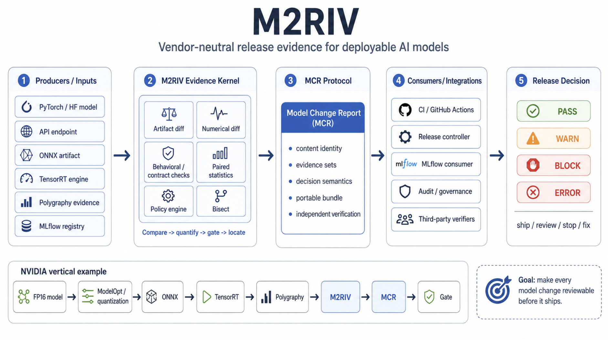

# M2RIV

[](https://github.com/niansia/M2RIV/actions/workflows/ci.yml)
[](LICENSE)
[](pyproject.toml)

**Model-to-Release Inspection & Verification** *(pre-alpha working name)*

M2RIV is the **vendor-neutral release-evidence layer for deployable AI models**.
It turns a change between model builds into a portable, content-addressed, and
independently checkable Model Change Report (MCR).

> MCR is the protocol candidate. M2RIV is the reference implementation.



Named products in the diagram are interoperability examples, not bundled
dependencies or endorsements. Verification covers declared integrity and
conformance; it does not establish producer identity.

## Quick start

Install the current source and run the small recorded-output example:

```console
git clone https://github.com/niansia/M2RIV.git
cd M2RIV
python -m pip install -e .

m2riv compare \
  examples/recorded_compare/baseline.jsonl \
  examples/recorded_compare/candidate.jsonl \
  --suite examples/recorded_compare/suite.jsonl \
  --policy examples/recorded_compare/policy.yaml \
  --slice-key frequency \
  --output runs/quickstart

m2riv mcr verify runs/quickstart --strict
```

The example intentionally returns `BLOCK` (exit code `2`): the declared rare
slice regresses more sharply than the common slice. It writes a compiled release
plan, an evidence manifest, MCR JSON, Markdown, JUnit, and SARIF without requiring
model downloads or network access. See the [full quickstart](docs/quickstart.md).

## Why this exists

Model builds cross optimizer, compiler, runtime, hardware, registry, and CI
boundaries. Each tool may produce a correct local answer while the release still
lacks one portable object that binds the exact artifacts, evidence, statistics,
policy, decision, and regression onset.

M2RIV does not replace native tools:

| Existing capability | Keep using it for | M2RIV adds |
|---|---|---|
| Model optimizers and compilers | Producing deployable artifacts | Artifact identity, retained evidence, and release semantics |
| Backend debuggers such as Polygraphy | Layer/output comparison | A portable bundle for downstream verification and policy |
| Evaluation and registry systems such as MLflow | Metrics, experiments, and lifecycle workflows | Cross-tool evidence and a producer-neutral MCR boundary |
| CI and promotion controllers | Workflow execution | Fail-closed PASS/WARN/BLOCK/ERROR decisions with auditable inputs |

For prompts, RAG applications, or agent trajectories, use an application-evaluation
tool first. For backend or layer debugging, use the native debugger first. M2RIV
starts where those results must become reviewable release evidence. The detailed
boundaries are documented in [when to use each tool](docs/competitive-landscape.md).

## Reproducible release regression

The CPU-only ONNX demo exports one fixed model to FP16 and three real INT8 QDQ
builds, evaluates 629 paired holdout cases, and catches a calibration-range
regression that is much larger on an input-declared critical slice:

| Build | Overall | Critical rare slice | Gate |
|---|---:|---:|---:|
| FP16 baseline | 94.75% | 91.49% | PASS |
| INT8 balanced | 94.75–94.91% | 91.49–93.62% | PASS |
| INT8 scale 0.65 | 92.85–93.16% | 74.47–78.72% | BLOCK |
| INT8 scale 0.60 | 92.37–92.85% | 70.21–76.60% | BLOCK |

First bad build: **INT8 scale 0.65**. The example also records ONNX semantic diff,
per-tensor numerical divergence, gate evidence, and executed bisect. Run it with:

```console
python -m pip install -e ".[onnx-demo]"
python examples/onnx_quantization/run_demo.py --output runs/onnx-quantization
```

The [NVIDIA vertical](examples/nvidia_tensorrt_vertical/README.md) exercises the
same boundary with ModelOpt, TensorRT, and Polygraphy on an RTX 4060 Laptop GPU.
Its large retained evidence is distributed as a
[GitHub Release asset](https://github.com/niansia/M2RIV/releases/tag/evidence-rtx4060-20260829)
rather than stored in Git history; the repository keeps the small receipt, hashes, scripts, and
[reproducible case study](docs/release-evidence-case-study.md).

## MCR at a glance

MCR 0.4 binds:

- immutable baseline and candidate snapshot identities;
- executor, runtime, platform, and build provenance;
- paired metrics, uncertainty, sample size, and slice scope;
- the exact versioned policy and four-state release decision;
- content-addressed evidence sets and supplemental evidence;
- a replay-stable `evidence_id`, decision-bound report `id`, and exact `run_id`;
- optional artifact diff, numerical diff, and first-bad-build evidence.

Any conforming producer may emit MCR without using the M2RIV CLI. A consumer can
verify and consume it without importing M2RIV Python:

```console
m2riv conformance producer examples/mcr_conformance
m2riv mcr verify examples/mcr_conformance/full --strict
```

`valid` means the performed integrity checks passed. It does **not** mean the
producer is authenticated or the model is safe. Verification reports its trust
scope, coverage, completeness, and recomputability explicitly.

## Project map

| Area | Entry point |
|---|---|
| Quickstart and generated files | [docs/quickstart.md](docs/quickstart.md) |
| Architecture and extension boundaries | [docs/architecture.md](docs/architecture.md) |
| MCR specification | [docs/mcr-specification.md](docs/mcr-specification.md) |
| Normative JSON Schemas | [schemas/mcr-0.4](schemas/mcr-0.4) |
| Producer/consumer conformance | [docs/mcr-conformance.md](docs/mcr-conformance.md) |
| Compatibility and migrations | [docs/mcr-compatibility.md](docs/mcr-compatibility.md) · [docs/mcr-0.4-migration.md](docs/mcr-0.4-migration.md) |
| Golden vectors and cross-language identity | [examples/content_identity](examples/content_identity) |
| Reference integrations | [integrations](integrations) |
| Regression corpus | [corpus](corpus) |
| Threat models and security reporting | [SECURITY.md](SECURITY.md) · [RFC 0004](rfcs/0004-purple-team-threat-model.md) · [RFC 0005](rfcs/0005-network-and-bisect-threat-model.md) |
| Protocol governance and design decisions | [docs/protocol-governance.md](docs/protocol-governance.md) · [rfcs](rfcs) |
| Planned compatibility work | [ROADMAP.md](ROADMAP.md) |

The base package has four runtime dependencies: `httpx`, `pydantic`, `PyYAML`,
and `typer`. ONNX, demo, and integration toolchains remain optional.

## Development

```console
uv sync --frozen --extra dev --extra onnx
uv run --frozen ruff check .
uv run --frozen mypy src
uv run --frozen pytest
```

CI also checks schema drift, content-identity vectors, Rust interoperability,
reproducible builds, the composite action, CPU ONNX evidence on Linux and Windows,
dependency review, CodeQL, and OpenSSF Scorecard signals.

M2RIV is pre-alpha. Public contracts use explicit schema versions, but stability
is not promised until v1.0. The project currently has no publicly verified
external adopter; repository-owned integrations are not counted as adoption.
The product name remains provisional until [RFC 0008](rfcs/0008-brand-decision-gate.md)
is resolved.

## Contributing and security

Read [CONTRIBUTING.md](CONTRIBUTING.md) before opening a change. Compatibility
reports and questions follow [SUPPORT.md](SUPPORT.md). Report vulnerabilities only
through the [private security advisory form](https://github.com/niansia/M2RIV/security/advisories/new),
not a public issue.

## Citation

Citation metadata is available in [CITATION.cff](CITATION.cff).

## License

Apache-2.0. See [LICENSE](LICENSE).
